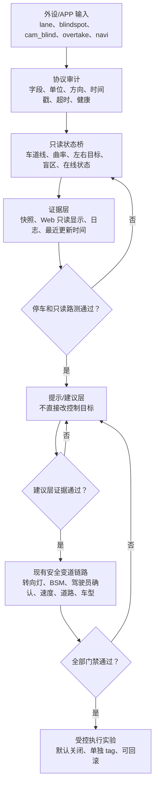

# SunnyPilot C3 新架构研究和迁移计划

日期：2026-06-19

本文件定义“第三条线”的完整开发计划：追官方 SunnyPilot 新架构和模型管理器，同时保留当前 CarrotPilot-C3-ESCC 主线的实车稳定性。

## 一句话结论

新架构目标应以官方 SunnyPilot `staging` 0.11.2 为主上游，Mr.One 只作为 C3/TICI 兼容补丁参考，不作为我们的主基座。

原因：

- 官方 SunnyPilot `dev`、`staging`、`master` 现在都是 `COMMA_VERSION 0.11.2`。
- Mr.One `openpilot/dev` 与官方 SunnyPilot `dev` 是同一个提交。
- Mr.One `openpilot/staging` 与官方 SunnyPilot `staging` 只差 4 个文件，主要不是完整 C3 迁移线。
- Mr.One `openpilot/devc3` 是 `0.11.1`，适合作为 C3 兼容补丁样本，但不是最新官方线。
- Mr.One `openpilot/res` 是 `0.10.1`，适合作为旧 TICI/C3 兼容参考，但离最新架构更远。
- Mr.One `openpilot/release-new` 是 `IQ.Pilot 1.0c / COMMA_VERSION 0.10.4`，体系不同，私货更多，不适合作为 SunnyPilot 新架构基座。
- ajouatom `carrot-wip` 是 Carrot 的 `0.11.1` C4 方向，可以参考 Carrot 自己的迁移方式，但它没有 SunnyPilot 的模型管理器体系。

## 分支和版本矩阵

| 来源 | 分支 | 版本 | 提交日期 | 用途 |
| --- | --- | --- | --- | --- |
| official SunnyPilot | `dev` | `0.11.2` | 2026-06-09 | 最新开发参考 |
| official SunnyPilot | `staging` | `0.11.2` | 2026-06-09 | 首选新架构实验基座 |
| official SunnyPilot | `master` | `0.11.2` | 2026-06-09 | 稳定主线参考 |
| official SunnyPilot | `release-tizi` | `0.11.1` | 2026-05-27 | 0.11 TICI/TIZI 发布参考 |
| official SunnyPilot | `staging-tici` | `0.10.1` | 2025-10-13 | 旧 TICI 参考 |
| Mr.One openpilot | `dev` | `0.11.2` | 2026-06-09 | 与官方 `dev` 相同 |
| Mr.One openpilot | `staging` | `0.11.2` | 2026-06-17 | 接近官方 `staging`，只做对照 |
| Mr.One openpilot | `devc3` | `0.11.1` | 2026-05-10 | C3 兼容补丁样本 |
| Mr.One openpilot | `res` | `0.10.1` | 2026-06-15 | 旧 C3/TICI 兼容补丁样本 |
| Mr.One openpilot | `release-new` | `0.10.4` | 2026-06-07 | IQ.Pilot 体系，只研究，不采用 |
| ajouatom CarrotPilot | `carrot-wip` | `0.11.1` | 2026-06-18 | Carrot C4 迁移参考 |
| ajouatom CarrotPilot | `c3-wip` | `0.9.9` | 2026-06-18 | 当前 C3 主线底座 |

## 安装链接确认

Mr.One 的 `op.mr-one.cn` 短链接需要设备安装器 User-Agent。用户这台 C3 的 `/VERSION` 是 `12.4`，所以真实安装器请求头是：

```text
User-Agent: AGNOSSetup-12.4
```

确认过的链接：

| 链接 | 安装器形态 | 实际仓库 | 实际分支 |
| --- | --- | --- | --- |
| `https://op.mr-one.cn/res` | 旧 Qt AArch64 ELF | `https://jihulab.com/mr-one/openpilot.git` | `res` |
| `https://op.mr-one.cn/release-new` | 旧 Qt AArch64 ELF | `https://jihulab.com/mr-one/openpilot.git` | `release-new` |
| `https://op.mr-one.cn/devc3` | 旧 Qt AArch64 ELF | `https://jihulab.com/mr-one/openpilot.git` | `devc3` |
| `https://mr-one.cn/new/devc3` | 新 raylib AArch64 ELF | `https://jihulab.com/mr-one/onepilot.git` | `devc3` |

结论：Mr.One 同时有 `openpilot` 和 `onepilot` 两套安装入口。我们优先研究 `mr-one/openpilot`，因为 `op.mr-one.cn/devc3/res/release-new` 都指向它。

## Mr.One 只能当补丁参考

不能直接基于 Mr.One 的原因：

- `devc3` 为了让 C3/TICI 上路，直接绕过了官方的 TICI 分支限制。
- `devc3` 把 `PowerMonitoring.should_shutdown()` 改成永不关机，这不适合我们的 ACC 供电 C3，需要重新设计，不能照抄。
- `devc3` 修改了 `loggerd`、`micd`、`beep`、`c3_client` 等进程行为，存在私货和用途不明的组件。
- `res` 对 opendbc、安全、UI、硬件、电源、模型、服务 schema 改动很多，适合拆补丁，不适合整包合入。
- `release-new` 是 IQ.Pilot 命名空间和 schema，不是 SunnyPilot 命名空间，迁移成本和风险都更高。

可参考的补丁类型：

- 如何绕过或正确适配 `TICI` / `channel_type` 检查。
- C3 上 AGNOS、hardware、power、UI setup、installer 的兼容点。
- C3 上 `modeld_v2`、模型管理器、runner 切换的实际运行路径。
- `OffroadMode` / Always Offroad 与 panda relay 的关系。

不可直接照抄的改动：

- 永久禁用自动关机。
- 默认开启第三方云连接或上传。
- 未审查的 `c3_client`、注册、远程服务、私有服务。
- 大面积 opendbc/safety 改动。
- IQ.Pilot 的 schema、服务名、模型管理器命名空间。

## 新架构完整迁移目标

最终目标不是只做“能启动”的研究线，而是建立一条可长期维护的 alpha 新架构线：

- 基座：官方 SunnyPilot `staging` 0.11.2。
- 开发分支：`experimental/sunnypilot-011-c3`。
- 短安装分支：`alpha-sunnypilot-c3`。
- Pages 入口：`https://jiangnangenius.github.io/CarrotPilot-C3-ESCC/x`。
- 稳定线保护：现有 `personal/c3-escc-atune`、`/i`、`latest`、`install-c3-escc-test` 不随 alpha 改动。
- C3 兼容：只抽 Mr.One `devc3/res` 里必要的 C3/TICI 启动、硬件识别、installer、modeld 兼容补丁。
- 云服务：移除 Sunnylink、comma connect、上传、远程配对、云备份；保留本地 Wi-Fi、SSH、本地 Web、GitHub 更新、模型清单和模型下载。
- 电源：使用 SunnyPilot `OffroadMode` 承载 Always Offroad 语义，默认关闭，不新增 `AlwaysOffline` 等混淆别名。
- 车型：新增 `KIA_SELTOS_2023`，复用 Seltos 2021 SCC 纯 CAN 配置；排除 `KIA_SELTOS_2023_NON_SCC`。
- ESCC：使用 SunnyPilot 原生 `0x2AB` 自动识别 `ENHANCED_SCC`，不做普通用户手动开关。
- 模型：采用 SunnyPilot 原生模型管理器、`ModelManager_ActiveBundle`、`ModelRunnerTypeCache` 和 `modeld_tinygrad`。
- 限速：新增手机/APN/N/Navipilot 来源，优先级为新鲜手机数据 > 车机限速 > OSM/mapd > 无来源，并加入超时回退。
- 手机限速入口：通过本地 Carrot Web `/api/phone_speed_limit` 写入 `CarrotPhoneSpeedLimit*` 参数；该入口只接收限速数据，不接收或执行变道、超车、外设控制命令。
- 地图：Mapbox/Kakao/Carrot route 只作为可选显示，新增 `CarrotMapOverlayEnabled=0`，默认不加载地图覆盖。
- Carrot：迁移 CarrotMan、CP搭子/Navipilot、APN/N、导航事件、SDI/测速/减速带、model speed、Carrot Web。
- fishop 硬件增强：迁移车道识线/车道曲线、左右车道数据、外接激光雷达盲区、侧向目标、传感器健康状态和自动超车参考逻辑；默认只读、默认关闭。
- fishop 最新参考入口：以 `fishop/cp` 的 `selfdrive/carrot/amap_navi.py`、`cereal/custom.capnp`、`cereal/log.capnp`、`selfdrive/apilot.json` 为第一批审计入口；只拆数据协议和安全门，不整包合并。
- 高风险控制：红灯停车、自动转弯减速、主动限速控制、Auto-Tuner 自动应用独立开关，默认不改变控制目标。
- 自动超车：只能接入现有安全变道链路，必须经过转向灯、原车/外接盲区、驾驶员确认、速度范围、道路类型和 Seltos 2023 车型门禁；高德/国内导航不适配时自动降级。
- Auto-Tuner：迁移学习、推荐值、历史记录、手动应用；`CarrotLearningActive=0`，`CarrotLearningAutoApply=0`。
- 本地化：清理韩文直出，补中文和英文说明。

细粒度执行清单维护在 [TODO.md](TODO.md) 的 `P8: SunnyPilot 0.11+ / C3 新架构完整开发线`。

目标分三条线，互不混合。

### A. 日常主线

分支：`personal/c3-escc-atune`

用途：当前可安装、可回滚、优先服务用户 C3 + Seltos 2023 + ESCC。

要求：

- 继续以 CarrotPilot `c3-wip` 为底。
- ESCC 可用但默认关闭。
- `EnableConnect=0`。
- `AlwaysOffroad=0`，仅保留开关。
- `AutoNaviSpeedLimitOffset=0`，`AutoNaviSpeedSafetyFactor=100`。
- 不把 SunnyPilot 0.11 或模型管理器直接合入。

### B. 新架构实验线

建议分支：

```text
experimental/sunnypilot-011-c3
```

用途：以官方 SunnyPilot `staging` 或 `master` 为基座，移植 C3 兼容补丁，先让 C3 停车启动、模型管理器、stock modeld 跑起来。

首选基座：

```text
official SunnyPilot staging 0.11.2
```

备选基座：

```text
official SunnyPilot master 0.11.2
official SunnyPilot release-tizi 0.11.1
```

参考补丁：

```text
mr-one/openpilot devc3
mr-one/openpilot res
ajouatom/openpilot carrot-wip
```

第一阶段只做：

- C3/TICI 启动兼容。
- 安装器可下载和拉取分支。
- manager 可启动。
- UI 可进入设置。
- `modeld` stock 路径可运行。
- `models_manager` 可在 offroad 运行。

第一阶段不是完整功能发布阶段，因此禁止直接上路或同时打开高风险功能：

- 不把 alpha 改动合回稳定线。
- 不用新模型直接上路。
- 不把 Carrot 高级控制、Auto-Tuner 自动应用、主动限速、红灯停车或自动转弯减速默认打开。
- 不让 Seltos Non-SCC 路径参与匹配。
- 不连接 Sunnylink、comma connect、上传或云备份。
- 不做实车上路；先完成 C3 停车证据。

### C. 最新模型 alpha 线

建议分支：

```text
experimental/sunnypilot-model-manager-c3
```

或继续使用现有短安装别名：

```text
alpha-supercombo
```

用途：只研究 SunnyPilot 模型管理器和 `modeld_v2`。

重点：

- 官方 SunnyPilot 新线有 `sunnypilot.models.manager`。
- 默认模型名是 `CD210`。
- 模型列表来自 `sunnypilot-models` 的 `driving_models_v17.json`。
- 模型 runner 通过 `ModelManager_ActiveBundle` 和 `ModelRunnerTypeCache` 切换。
- 未选择模型时回退 stock runner。
- `models_manager` 只在 offroad 运行。
- `modeld_tinygrad` 只在 active runner 是 tinygrad 时运行。

第一目标不是“直接用最新模型开车”，而是证明 C3 上：

- offroad 可以下载或识别模型列表。
- active bundle 不存在时能回退 stock。
- tinygrad runner 选择后不会 crash loop。
- `modelV2`、`drivingModelData`、`cameraOdometry` 正常发布。
- 温度、CPU/GPU、帧率可接受。

## 推荐执行顺序

### 阶段 0：现有主线冻结

- 当前 `personal/c3-escc-atune` 保持 CarrotPilot 0.9.9-era。
- 不把新架构合回日常主线。
- 已备份用户 C3 参数，继续保留。
- 下一次上车测试仍以现有主线为目标。

### 阶段 1：建立 SunnyPilot 新架构研究分支

创建：

```bash
git checkout --orphan experimental/sunnypilot-011-c3
```

或用单独工作树从官方 SunnyPilot `staging` 初始化，避免污染当前 Carrot 主线。

加入远端：

```bash
git remote add sunnypilot https://github.com/sunnypilot/sunnypilot.git
git remote add mrone-openpilot https://jihulab.com/mr-one/openpilot.git
```

只抓必要分支：

```bash
git fetch --depth=1 sunnypilot staging master dev release-tizi staging-tici
git fetch --depth=1 mrone-openpilot devc3 res release-new staging dev
```

### 阶段 2：抽取 C3 兼容补丁

只审这些路径：

```text
system/hardware/
system/manager/
system/ui/tici_setup.py
selfdrive/ui/installer/
selfdrive/modeld/
sunnypilot/modeld_v2/
sunnypilot/models/
cereal/custom.capnp
cereal/log.capnp
cereal/services.py
common/params_keys.h
selfdrive/pandad/
opendbc_repo/opendbc/car/hyundai/
opendbc_repo/opendbc/sunnypilot/car/hyundai/
```

每个补丁必须回答：

- 这是 C3 必需，还是 Mr.One 私货？
- 是否影响上路安全？
- 是否影响关机、电源、panda relay、CAN 输出？
- 是否影响官方服务器连接、注册、上传？
- 有没有更小的实现方式？

### 阶段 3：先跑设备，不跑车

C3 停车验证：

- 能安装。
- 能启动。
- UI 不黑屏。
- offroad 网络可用。
- `models_manager` 不崩。
- stock `modeld` 不崩。
- 不启用 ESCC。
- 不连接官方 comma connect。
- 不默认开启 Sunnylink 上传。

最低设备证据：

```bash
python3 scripts/personal/device_snapshot.py --output /data/media/0/sunnypilot-011-c3-snapshot.md
```

再采集：

```bash
journalctl -u comma -n 300
tmux capture-pane -p
```

### 阶段 4：迁移本地必需功能和完整 Carrot 功能

停车验证通过后，再逐项移植：

- Seltos 2023 车型，继续复用 Seltos 2021。
- 移除云连接和上传服务；不再暴露 `EnableConnect`/Sunnylink/Onroad Uploads 云功能。
- Always Offroad 语义使用 SunnyPilot 的 `OffroadMode`，不能再造别名。
- ESCC 只走 0x2AB 自动识别。
- SunnyPilot 原生模型管理器和回滚证据。
- phone/APN/N/Navipilot 限速来源，带超时回退。
- speed camera 默认偏移归零和百分比偏移。
- `CarrotMapOverlayEnabled=0`，地图覆盖默认不加载。
- CarrotMan、CP搭子/Navipilot、APN/N、导航事件、SDI/测速、减速带、model speed、Carrot Web。
- fishop/码上飞扬硬件增强输入：车道曲线、左右车道数据、激光雷达盲区、侧向目标、传感器健康，第一阶段只读记录和显示。
- fishop/码上飞扬自动超车：先只提示/只建议，后续才允许受控执行，且不得绕过安全变道链路。
- fishop/码上飞扬硬件图流：



- fishop/码上飞扬硬件输入必须先分清方向：
  - C3 发给外设的数据，例如巡航速度、车速、原车盲区、雷达摘要、车道/路沿概率。
  - 外设发给 C3 的数据，例如 `lane`、`blindspot`、`cam_blind`、左右目标距离、左右目标横向距离、盲区位。
  - APP 或外设发起的 `overtake`/变道命令，默认只能记录，不能直接执行。
- 自动超车分五步放行：
  - 只接收和记录。
  - 只显示。
  - 只提示。
  - 只建议，现有安全变道链路可拒绝。
  - 受控执行实验，必须保留驾驶员确认和回滚安装器。
- 红灯停车、自动转弯减速、主动限速控制独立开关，默认关闭。
- Auto-Tuner 学习、推荐、历史、手动应用，自动应用默认关闭。
- 用户参数迁移脚本。
- 中文/英文本地化。

### 阶段 5：实车前门禁

上路前必须通过：

- 静态检查。
- schema 生成检查。
- manager/process_config 检查。
- Hyundai/Seltos safety 检查。
- 默认参数检查。
- 设备停车证据。
- 回滚安装器可用。

实车第一轮只允许：

- 白天。
- 熟悉路段。
- 不启用 ESCC。
- 不启用新模型。
- 只验证启动、识别、横控基础行为。

ESCC 和新模型必须分开测试，不得同一天同一构建同时打开。

## 安装器计划

保留现有默认安装入口：

```text
https://jiangnangenius.github.io/CarrotPilot-C3-ESCC/i
```

新增实验入口建议：

```text
https://jiangnangenius.github.io/CarrotPilot-C3-ESCC/x
```

`/x` 指向新架构实验分支，不指向日常主线。

不要让：

- `/i`
- `latest`
- `install-c3-escc-test`

自动切到新架构分支。

## 后续更新策略

每次用户说“更新新架构线”时：

1. 先拉官方 SunnyPilot `staging/master/dev`。
2. 再拉 Mr.One `devc3/res/release-new/staging/dev`。
3. 确认 Mr.One `dev` 是否仍等于官方 `dev`。
4. 确认 Mr.One `staging` 与官方 `staging` 差异是否仍很小。
5. 只把 Mr.One `devc3/res` 当 C3 补丁参考。
6. 不从 `release-new` 整体移植，只查 IQ.Pilot 是否有可借鉴的小补丁。
7. 更新本文件的版本矩阵。
8. 不推送安装器，除非设备停车验证通过。

## 当前判定

现在可以开始开第三条线，但不能开始实车测试。

推荐下一步：

```text
建立 experimental/sunnypilot-011-c3
```

然后从官方 SunnyPilot `staging` 起步，逐项移植 Mr.One `devc3` 的 C3 必需补丁。
