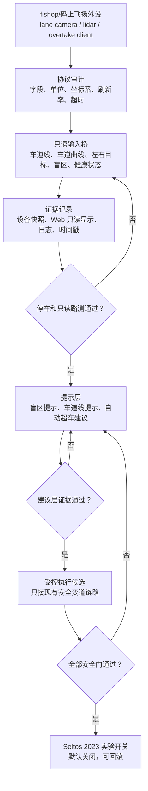
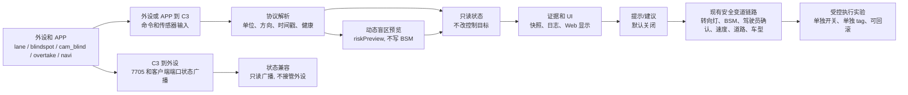

# TODO 主计划

## P0: 项目底座

- [x] 确认 GitHub 仓库名称、公开或私有状态。
- [x] 正式创建 GitHub 仓库：`JiangNanGenius/CarrotPilot-C3-ESCC`，公开。
- [x] 以 `ajouatom/openpilot:c3-wip` 建立本地主底座。
- [x] 核对来源关系：`ajouatom/openpilot` 作为 CarrotPilot / CarPad 韩国主源底座；`dhvms/carrotpilot` 只做旧版历史参考。
- [x] 添加本地远端：
  - `origin`: `https://github.com/ajouatom/openpilot.git`
  - `github`: `https://github.com/JiangNanGenius/CarrotPilot-C3-ESCC.git`
  - `jixie`: `https://github.com/jixiexiaoge/openpilot.git`
  - `jixie-navipilot`: `https://github.com/jixiexiaoge/navipilot.git`
  - `fishop`: `https://jihulab.com/fishop/openpilot.git`
  - `dhvms`: `https://github.com/dhvms/carrotpilot.git`
- [x] 建立当前开发分支：
  - `personal/c3-escc`
- [x] 建立完整长期分支：
  - `upstream/c3-wip`
  - `personal/c3-escc`
  - `personal/c3-escc-atune`
  - `tracking/fishop-cp`
  - `tracking/jixie-atune`
  - `tracking/jixie-master`
  - `tracking/jixie-navipilot`
  - `tracking/model-selector`
  - `tracking/c4`

## P1: 用户车辆优先支持

- [x] 建立 Seltos 2023 车辆档案。
- [x] 新建 Kia Seltos 2023 独立车型条目。
- [x] 初期复用 Kia Seltos 2021 的 harness、物理参数、转向配置和 checksum flag。
- [x] 确认当前实际可用路径为 Seltos 2021 配置。
- [x] 记录车辆为纯 CAN，不是 CANFD。
- [ ] 确认 fingerprint、FW 查询、SCC/ESCC 硬件接线方式。
- [x] 确认代码改动没有覆盖原有 Seltos 2021 条目。
- [x] 增加安全参数迁移脚本，用于从当前可工作的 fishop / 飞扬版本导出设置白名单，再导入本项目版本。
- [ ] 确认当前设备上可工作的 CarrotPilot 版本和参数快照。
- [x] 增加 C3 设备端快照脚本，用于记录安全参数、分支、tag、进程状态和可选 0x2AB / CP搭子消息计数。
- [x] 设备快照新增隐私安全 CarParams 摘要，用于确认 Seltos 车型路径和 safety 配置。
- [x] 增加一键实车证据采集脚本，用于把静态检查、设备快照、路测草稿和清单放进同一个文件夹。
- [x] 证据检查器支持直接读取一键采集生成的证据包目录。
- [x] 增加实车证据就绪度报告，分阶段提示设备快照、CarParams、ESCC 0x2AB、路测记录和 stable gate 缺口。
- [x] 设备快照和证据检查器支持只读 AmapNavi 状态桥采样，可选要求 `EnableAmapNaviStatus=1` 和 `amapNavi_updates > 0`。
- [x] 增加 Seltos 2023 车型复用检查脚本，防止更新后误改 CANFD/HDA2 或打破 2021 兼容路径。
- [x] 列出 Seltos 2021/2023 相关 Hyundai 文件；当前只有 `values.py` 需要显式 2023 车型条目，其它文件保持通用 Hyundai/Kia CAN 路径：
  - `opendbc_repo/opendbc/car/hyundai/values.py`
  - `opendbc_repo/opendbc/car/hyundai/interface.py`
  - `opendbc_repo/opendbc/car/hyundai/carstate.py`
  - `opendbc_repo/opendbc/car/hyundai/carcontroller.py`
  - `opendbc_repo/opendbc/car/hyundai/hyundaican.py`
  - `opendbc_repo/opendbc/car/hyundai/hyundaicanfd.py`
  - `opendbc_repo/opendbc/car/hyundai/radar_interface.py`
  - `opendbc_repo/opendbc/car/hyundai/fingerprints.py`

## P2: ESCC 必迁

- [x] 从 `fishop/openpilot:cp` 提取 ESCC 相关改动。
- [x] 不直接整包合并 fishop 分支，先拆成最小功能补丁。
- [x] 迁移参数：
  - `EnableEscc`
  - `EnableRadarTracks`
  - `EnableRadarTracksResult`
  - `HyundaiCameraSCC`
  - `CanfdHDA2`，只保留为其它车兼容项，Seltos 2023 不走 CANFD/HDA2 路径。
  - `RadarLatFactor`
  - `EnableCornerRadar`
- [x] 迁移 Hyundai 安全标志和 ESCC 标志。
- [x] 迁移 ESCC 雷达解析逻辑。
- [x] 迁移 ESCC AEB/SCC 消息保留逻辑。
- [x] 迁移 ESCC 与 openpilot longitudinal control 的启用条件。
- [x] 给 Seltos 2023 优先加默认保护：默认关闭 ESCC，必须显式参数开启。
- [x] Seltos 2023 不默认开启 CANFD、HDA2、CanfdHDA2 相关 flag。
- [x] 做一次静态检查：所有 ESCC 路径都必须有参数开关保护。
- [x] 做一次上车前静态 dry-run：确认无缺失 capnp、DBC、Params key。
- [ ] 上车确认 ESCC 0x2AB、lead、AEB/FCW 和 SCC 状态真实正常。
- [ ] 用 `device_snapshot.py --sample-seconds 20` 保存 ESCC 0x2AB 静态采样结果。

## P2.5: C3 克隆版 Connect / Offroad 模式

- [x] 新增 `AlwaysOffroad` 参数，默认关闭，仅作为驻车供电更新/故障排查开关。
- [x] 新增/保留 `EnableConnect` 参数，默认关闭，避免克隆 C3 连接官方注册/远程连接服务。
- [x] 设置菜单加入“强制 Offroad 模式”和“在线连接”。
- [x] `EnableConnect=0` 时跳过在线注册。
- [x] `AlwaysOffroad=1` 时强制保持 offroad，不进入驾驶控制路径。
- [x] `AlwaysOffroad=1` 时 pandad 强制 panda `NO_OUTPUT`，避免接管 harness 继电器。
- [x] `AlwaysOffroad=1` 时本地 Web/SSH/更新仍保持可用。
- [x] 设备快照和 stable evidence gate 增加默认连接守卫，要求 `AlwaysOffroad=0`、`EnableConnect=0` 且看不到远程连接 / 上传进程；AlwaysOffroad 更新/调试守卫保留为手动调试项。
- [x] 增加 ACC/CAN 断电重启记录脚本和 stable gate 检查，要求 `PowerCycleBootOk=1` 且记录 commit 匹配设备快照 commit。
- [ ] 上车确认 ACC/CAN 供电断电重启后能直接进入系统。

## P3: 机械小哥功能整合

- [x] `jixiexiaoge/openpilot:CP` 已基本进入 `ajouatom/c3-wip`，先不重复合并。
- [x] 从 `jixiexiaoge/openpilot:atune` 完成初步拆分评估。
- [x] 写入 [机械小哥 atune 整合计划](ATUNE_INTEGRATION_PLAN.md)。
- [x] 新开 `personal/c3-escc-atune` 分支。
- [x] 第一批只迁移 Auto-Tuner 核心，默认关闭，禁止自动应用。
- [x] 第二批完成 Web 推荐值面板和手动确认流程。
- [x] 从 `jixiexiaoge/openpilot:master` 记录 CP搭子 / Navipilot 功能边界。
- [x] 建立 `tracking/jixie-master`，跟踪 CP搭子 / Navipilot 项目说明和应用方向。
- [x] 从 `jixiexiaoge/navipilot:CPdazi` 完成第一轮 APP / 驾驶报告 / WebSocket 需求研究。
- [x] 建立 `tracking/jixie-navipilot`，跟踪 Android CP搭子 APP 来源。
- [x] 增加 CP搭子 / Navipilot 核心协议静态 preflight。
- [x] 增加 Navipilot APP 参数读写接口静态守卫，确认 7000 端口 `/api/params_bulk` 和 `/api/param_set` 兼容 APP 的 `CarrotParamClient`。
- [x] 增加 CP搭子 / Navipilot 设备端采样字段和可选证据校验门槛。
- [x] 增加 Navipilot APP 端点 live check，可在 C3 上验证 7000 参数接口、7705 状态广播和可选 7706 测试导航输入。
- [x] 增加 Navipilot APP 驾驶评分/报告源码契约守卫，跟踪 `DrivingDataCollector`、`DrivingScoreEngine`、`DrivingReportScreen` 和本地报告存储。
- [x] 建立 `tracking/model-selector`，跟踪 `ajouatom/openpilot:happymaj11r/carrot-wip-model_selector` 作为模型选择器参考线。
- [x] 增加模型选择器源码审计脚本，确认参考线安全条件存在且当前默认 C3 主线未半截启用模型切换。
- [x] 增加模型选择器设备端只读状态采集，记录 `DrivingModelName`、`PendingModelName` 和 `/data/model_selector_status` engine，不启用下载/安装/modeld 切换。
- [x] 增加机械小哥 / fishop 功能边界静态检查，防止自动超车、AmapNavi、独立 Web/哨兵服务无保护进入主线。
- [x] 增加个人功能状态报告，区分已静态具备、已有但待实机验证、故意隔离和未迁移功能。
- [ ] 机械小哥功能分批迁移：
  - [x] CP搭子 CarrotMan / Navipilot 核心协议静态兼容。
  - [ ] CP搭子 Android APP 实测连接和导航数据流。
  - [x] 7000 Web 控制台现有能力静态确认：端口 7000、dashcam、screenrecord、tools、terminal、vision diagnostics、Auto-Tuner 面板。
  - [ ] 7000 Web 剩余增强和实机验证。
  - [x] 实验模式 Web 开关静态确认。
  - [ ] 自动实验模式切换完整闭环。
  - [ ] 模型选择切换器。
  - [ ] 自动超车。
  - [ ] Navipilot APP 驾驶报告实测。
  - [x] LED / cluster HUD 代码和 manager 参数门控静态确认。
  - [ ] LED / cluster HUD 实机验证和默认策略。
  - [x] Auto-Tuner / atune 第一批核心学习器。
  - [x] Auto-Tuner / atune 第二批手动确认闭环。
- [ ] 每批迁移都单独提交，避免以后更新冲突时无法回滚。

## P4: fishop 非 ESCC 功能整合

- [x] 从 `fishop/openpilot:cp` 完成第一轮国内导航/APP 控制功能边界拆分。
- [x] 评估 `amap_navi.py` 与机械小哥 CP搭子的功能重叠。
- [x] 评估转向灯板控制、雷达/激光雷达盲区、APP 控制变道、纵控平顺停车等功能。
- [x] 增加 AmapNavi / 自动超车 / DEC 来源审计脚本，确认 fishop 和 Navipilot APP 参考源存在，同时默认 C3 主线保持隔离。
- [x] 单独迁移只读 AmapNavi 状态兼容桥，默认关闭，只发布车道线和原车盲区状态，不接收 APP 命令。
- [x] 给只读 AmapNavi 状态桥补设备端采样和可选证据检查，不把它作为 stable 必需项。
- [ ] 单独迁移 fishop 完整 `amap_navi.py` 或 APP/导航增强，不能整包合并。
- [ ] 跟踪 fishop/码上飞扬最新版“车道识线 / 车道曲线”功能，确认输入来源、坐标系、刷新率、可信度字段和失败状态。
- [x] 跟踪 fishop/码上飞扬外接激光雷达 / 侧向感知硬件，确认左右侧数据、左右盲区数据、目标距离/速度、传感器健康状态和断线行为；alpha 只读 parser 记录 `detect_side`、`dist_time`、`lf/lb/rf/rb_drel`、`lf/lb/rf/rb_xrel`、`lf/lb/rf/rb_vrel` 和设备在线/超时状态。
- [x] 新增 fishop 硬件增强输入层，先只记录和显示，不进入控制：车道曲线、左右车道边界、左右盲区、侧向目标、传感器健康；alpha parser/Web/API/snapshot 均保持 `controlOutputEnabled=false`。
- [x] 新增 fishop 硬件增强参数门控，默认全部关闭：
  - `FishopLaneCurveEnabled=0`
  - `FishopLidarLaneDataEnabled=0`
  - `FishopLidarBlindspotEnabled=0`
  - `FishopAutoOvertakeEnabled=0`
- [ ] 迁移 fishop 自动超车 / APP 控制变道 / `OVERTAKE` 逻辑，必须接入现有安全变道链路，不允许绕过 turn signal、BSM、驾驶员确认、Seltos 2023 车型门禁。
- [ ] 自动超车第一阶段只做提示和日志，第二阶段只允许建议变道，第三阶段才允许受控执行；每阶段单独实车证据。
- [x] alpha 设备快照新增 fishop 自动超车分阶段证据账本：`fishopOvertakeStages` 固定第 1 步数据采集、第 2 步 Web/快照显示、第 3 步 hint-only、第 4 步现有安全变道链路建议审查、第 5 步受控执行实验；每阶段都有 requiredLog、`/x` alpha 安装入口、`/i` stable 回滚入口，且当前第 4/5 阶段保持 locked。
- [x] 国内导航 / 高德相关输入只能作为辅助来源；在澳洲或导航精度不足时，不能作为自动超车或侧向控制的唯一依据：alpha 新增 fishop `navigation` 证据和 `navigationGate`，只有新鲜 Amap/Gaode + 中国区域 + 精度阈值内才允许进入 `ready_for_suggestion` 审查；其它地区/来源只输出 `overtakeHint`，且 `controlEligible=false`。
- [x] alpha 设备快照和证据包新增 fishop 硬件采样：车道曲线、左右盲区、传感器在线、最近更新时间、自动超车状态。
- [x] fishop 最新参考入口已确认，后续迁移先审这些源码点，不按整包合并：
  - `selfdrive/carrot/amap_navi.py`: UDP 客户端、`lane`、`blindspot`、`cam_blind`、`overtake`、`navi`、`lidar` 数据通道。
  - `cereal/custom.capnp`: `CarrotMan.leftBlind/rightBlind` 和 `AmapNavi.leftBlind/rightBlind/lineValid/leftLine/rightLine`。
  - `cereal/log.capnp`: `DrivingModelData.LaneLineMeta`、`laneLines`、`roadEdges`、`laneWidthLeft/right`、`distanceToRoadEdgeLeft/right`。
  - `selfdrive/apilot.json`: `UseLaneLineSpeed`、`UseLaneLineCurveSpeed`、`LaneChangeNeedTorque` 等车道模式参数说明。
- [ ] fishop 硬件增强迁移图流：

- [ ] 图流门禁必须逐项落地：
  - 输入门：字段存在、单位明确、时间戳新鲜、左右方向不反、断线能清零。
  - 车辆门：仅 Seltos 2023 SCC 纯 CAN 实验启用，不进入 Non-SCC/CANFD/HDA2 路径。
  - 地图门：高德/国内导航只做辅助，澳洲或精度不足时自动降级；alpha 已实现 `navigationGate` / `overtakeHint`，澳洲、非高德、缺失精度或精度不足都会停在 hint-only / display-only。
  - 盲区门：原车 BSM 和外接盲区任一报警都阻止自动变道。
  - 驾驶员门：不绕过转向灯、手握/确认、油门/刹车/转向人工介入。
  - 模型门：车道线、路沿、曲率和传感器数据互相矛盾时只提示不控制。
  - 发布门：每阶段都有单独 tag、证据包和回滚安装器。
- [x] 决定哪些进入主分支，哪些放到实验分支：
  - ESCC 继续保留在主分支，默认关闭。
  - CP搭子 / Navipilot 核心协议保留在主分支，`LANECHANGE` 只走现有安全变道链路。
  - 只读 AmapNavi 状态桥保留主线默认关闭；fishop 完整 `amap_navi.py`、外接转向灯、lidar/侧向盲区、APP 自动超车和 `OVERTAKE` 放实验分支候选。
  - DEC / longcontrol 大改在 ESCC 和 Seltos 实车表现稳定前先不迁移。

## P5: C4 旁支

- [ ] 不作为主线目标。
- [x] 建立 `tracking/c4` 分支，暂按 `origin/carrot-wip` 跟踪。
- [ ] 后续确认 `origin/carrot-wip` 是否就是需要维护的 C4 线。
- [ ] 只在低成本时跟踪，不影响 C3/Seltos/ESCC 主线。

## P6: 发布和安装

- [x] 增加个人版本地 smoke 检查脚本。
- [x] 增加 ESCC / AlwaysOffroad 上车前静态 preflight 脚本。
- [x] 增加 CP搭子 / Navipilot 核心协议静态 preflight 脚本。
- [x] 增加功能边界守卫脚本，确认未验证高风险入口不在默认主线，已有 Web/cluster/ShareData 入口保持开关控制。
- [x] 增加功能状态报告脚本，防止 TODO 和实际代码能力脱节。
- [x] 增加上游更新审计脚本，检查三方来源、tracking 分支和高风险目录变化。
- [x] 增加上游更新计划脚本，默认只读输出 tracking 快进计划、高风险路径和后续门禁命令；显式加参数才同步 tracking 分支或更新基准文件。
- [x] 增加发布前 release gate，区分 static/test/stable tag。
- [x] 增加安装目标清单和检查脚本，防止把开发分支当成日常安装目标。
- [x] 增加路测证据检查脚本，stable 前强制检查路测记录、设备快照和 ESCC 0x2AB 采样。
- [x] 增加证据就绪度报告脚本，stable 前可先看阶段缺口再跑严格 gate。
- [x] 增加 C3 首次安装/迁移向导，把旧配置 dry-run/import、静态检查、证据采集和 readiness 报告串成一条设备端流程。
- [x] 推送主用分支 `personal/c3-escc` 到个人 GitHub 仓库。
- [x] 推送整合分支 `personal/c3-escc-atune` 到个人 GitHub 仓库。
- [x] 给当前静态预检通过版本打 `carrotpilot-c3-escc-20260618-static25` tag。
- [x] 给当前受控上车测试候选版本打 `carrotpilot-c3-escc-20260618-test17` tag。
- [x] 更新当前静态预检 tag 到 `carrotpilot-c3-escc-20260618-static28`。
- [x] 更新当前受控上车测试 tag 到 `carrotpilot-c3-escc-20260618-test21`，并发布 C3 二进制安装器和 SSH 备用安装脚本。
- [x] 更新当前受控上车测试 tag 到 `carrotpilot-c3-escc-20260618-test22`，包含本地化说明和发布检查单改进。
- [x] 更新当前受控上车测试 tag 到 `carrotpilot-c3-escc-20260618-test23`，安装后写入 C3 首启说明文件。
- [x] 准备当前受控上车测试 tag `carrotpilot-c3-escc-20260618-test24`，补充本地化审计覆盖的可见/诊断路径。
- [x] 准备当前受控上车测试 tag `carrotpilot-c3-escc-20260618-test25`，加入 ACC/CAN 断电重启确认记录和 stable gate 检查。
- [x] 增加固定 `latest` 安装入口和短链接入口，日常安装不再需要手动输入编号 test 链接。
- [x] 安装脚本支持 `--channel test|dev|static|stable` 和 `--ref`，方便以后切换分支或通道。
- [x] 写安装说明。
- [x] 写回滚说明。
- [x] 写上车测试记录模板。
- [x] 整理公开仓库根 README，明确当前状态、static tag、署名和安全边界。
- [x] 增加 GitHub Actions `Personal Smoke`，推送后自动跑个人静态检查。
- [x] 增加 GitHub Actions `Upstream Watch`，定期比较上游远端和 `UPSTREAM_BASELINES.json` 基准。
- [x] `Upstream Watch` 纳入 `jixiexiaoge/navipilot:CPdazi`，防止 APP 协议和驾驶报告更新漏审。
- [x] `Upstream Watch` 纳入 `ajouatom/openpilot:happymaj11r/carrot-wip-model_selector`，防止模型选择器参考线更新漏审。
- [x] 在 `INSTALL_TARGETS.json` 中预留 `previous_stable_tag` 和 `rollback_base_ref`。
- [x] 只把稳定 tag 作为设备日常安装目标；当前没有稳定 tag，所以 `daily_install_target` 必须为空。
- [ ] 第一次实车验证通过后，创建首个 `stable` tag，并更新 `INSTALL_TARGETS.json`。
- [ ] 首个 `stable` 前，必须保存 C3 设备快照并通过 `road_test_evidence_check.py --require-carparams-summary --require-default-connect-guard --require-power-cycle-boot --require-escc-sample`。

## P7: 中文翻译和参数说明优化

低优先级，等 ESCC 和 Connect / AlwaysOffroad 语义先稳定。

- [x] 梳理 `selfdrive/carrot_settings.json` 中明显机翻、韩文残留和含糊描述。
- [x] 第一批优先改启动、现代/起亚、雷达、纵控、转向相关高风险参数说明。
- [x] 第一批给 ESCC、CANFD/HDA2、Camera SCC、雷达轨迹、角雷达、Connect / AlwaysOffroad、车门/安全带屏蔽补“适用车型/默认建议/风险提示”。
- [x] 增加中文设置说明审计脚本，防止高风险中文说明退化。
- [x] 不改参数含义和默认值，只改显示文字。
- [x] 第二批清理外部 HUD、显示路径、导航减速和低风险显示项的措辞。
- [x] 第三批清理巡航、ATC、按键模拟、低速转向、关机时间、路径显示和跟车时间说明。
- [x] 清理设置表、Web 默认文案、导航 HUD、地图浮层、诊断输出里的韩文残留。
- [x] 将 Web 语言入口收敛为英文/中文；旧韩语缓存自动落到英文。
- [x] 增加本地化审计脚本，防止上游合并后重新出现韩文 UI 文案。
- [x] 扩展本地化审计到 cluster HUD git 状态、Auto-Tuner 参数注释和日志诊断注释，避免这些可见/诊断路径重新出现韩文。
- [x] 每批翻译单独提交，方便回滚。
- [ ] 继续低优先级打磨纯显示类、非关键类参数说明；只改显示文字，不改默认值、范围或控制含义。

## P8: SunnyPilot 0.11+ / C3 新架构完整开发线

独立 alpha 线，不影响当前 CarrotPilot-C3-ESCC 日常安装入口。现有 `personal/c3-escc-atune`、`/i`、`latest`、`install-c3-escc-test` 保持稳定线；新架构只走 `experimental/sunnypilot-011-c3`、`alpha-sunnypilot-c3` 和 Pages `/x`。

### P8.0: 研究结论和边界

- [x] 确认 Mr.One `op.mr-one.cn` 安装链接需要 `AGNOSSetup-12.4` User-Agent。
- [x] 确认 `op.mr-one.cn/res`、`release-new`、`devc3` 都指向 `jihulab.com/mr-one/openpilot.git` 的对应分支。
- [x] 确认 `mr-one.cn/new/devc3` 指向 `jihulab.com/mr-one/onepilot.git:devc3`，与 `op.mr-one.cn/devc3` 不是同一个安装器。
- [x] 确认官方 SunnyPilot `dev/staging/master` 当前是 `0.11.2`。
- [x] 确认 Mr.One `openpilot/dev` 与官方 SunnyPilot `dev` 相同。
- [x] 确认 Mr.One `openpilot/staging` 只接近官方 SunnyPilot `staging`，不是完整 C3 迁移基座。
- [x] 确认 Mr.One `openpilot/devc3` 是 `0.11.1` C3 兼容补丁样本。
- [x] 确认 Mr.One `openpilot/res` 是 `0.10.1` 旧 C3/TICI 兼容补丁样本。
- [x] 确认 Mr.One `openpilot/release-new` 是 IQ.Pilot `0.10.4` 体系，不作为 SunnyPilot 主基座。
- [x] 写入 `SUNNYPILOT_C3_LATEST_ARCHITECTURE_PLAN.md`。
- [x] 更新 `SUNNYPILOT_C3_LATEST_ARCHITECTURE_PLAN.md`，把本节完整开发计划同步进去。
- [x] 在 `AGENTS.md` 写清新架构线更新策略，后续用户说“继续更新新架构”时按本 P8 执行。

### P8.1: 基座、远端和分支

- [x] 新增远端 `sunnypilot`，指向官方 `https://github.com/sunnypilot/sunnypilot.git`。
- [x] 新增远端 `mrone-openpilot`，指向 `https://jihulab.com/mr-one/openpilot.git`。
- [ ] 只抓必要分支：SunnyPilot `staging/master/dev/release-tizi/staging-tici`；Mr.One `devc3/res/release-new/staging/dev`。
- [x] 从官方 SunnyPilot `staging` 0.11.2 建立独立工作树或分支 `experimental/sunnypilot-011-c3`。
- [x] 建立短安装分支 `alpha-sunnypilot-c3`，用于安装器不能输入带 `/` 分支名的场景。
- [x] 新增 Pages 入口 `/x` 指向 `alpha-sunnypilot-c3`。
- [x] 明确确认 `/i`、`latest`、稳定 release、`install-c3-escc-test` 不改指向。
- [x] 记录新架构基座提交、COMMA_VERSION、SunnyPilot 模型管理器版本和 Mr.One 参考提交。

### P8.2: C3/TICI 兼容补丁

- [ ] 对比 Mr.One `devc3` 与官方 SunnyPilot `release-tizi/staging`，列出 C3/TICI 必需补丁。
- [x] 已记录 Mr.One `devc3` 当前远端头 `5c0feefabdef5ec2186a33b1495891c38dcf5c36` 和 SunnyPilot `staging` / `release-tizi` 本地参考 refs；alpha 新增 `scripts/personal/sunnypilot_c3_compat_audit.py`，能在 Mr.One 本地 refs 可用时自动列出 watched C3/TICI 路径差异。
- [ ] 重新拉取 Mr.One `devc3` 树对象并完成逐文件差异归类；本轮 `ls-remote` 成功但 `fetch` 卡住，审计脚本会把 `mroneDevc3` 标为 missing，不误判完成。
- [ ] 对比 Mr.One `res` 与官方旧 TICI 线，列出旧 C3/TICI 可借鉴补丁。
- [x] 已记录 Mr.One `res` 当前远端头 `01e22f5921d9dfd49235f5867f54d9ec0bdccbaf`；审计脚本会在 `mroneRes` 本地 ref 存在时生成和当前 alpha 的 watched path 差异。
- [ ] 重新拉取 Mr.One `res` 树对象并完成旧 TICI 线逐文件差异归类；本轮 `fetch` 卡住，仍需后续补证据。
- [x] 抽取硬件识别补丁，确认克隆 C3 设备字符串为 `tici` 时不会被误判为 C4/C3X：alpha 审计确认 `/TICI` 设备仍走 `HardwareTici`，`tici/tizi` 只映射到 `TICI/TIZI`，相关路径不含 C4/C3X 分支。
- [x] alpha 修复 C3 分支通道识别：`alpha-sunnypilot-c3`、`experimental/sunnypilot-011-c3` 和 `*-c3*` 分支在 `system/version.py` 中归类为 `channel_type=tici`，避免 `hardwared` 把用户 C3 当作不支持的 `tici` + feature branch 组合拦在 offroad。
- [x] 抽取启动和 UI setup 必需补丁：`launch_openpilot.sh` 在 `comma tici` 设备上转入 `sunnypilot/system/hardware/c3/launch_chffrplus.sh`，C3 launcher 保留 AGNOS / safe staging / manager 启动路径；静态审计覆盖 C3 launcher、C3 env 和 C3 AGNOS manifest 存在。
- [x] 抽取 installer 必需补丁，保证二进制安装器能拉 `alpha-sunnypilot-c3`：installer 保留 TICI/TIZI 设备识别、TICI 安装 UI 和 `migrated_branch = BRANCH_STR`，不会把 alpha 分支强制迁移到 release/master。
- [x] 抽取 modeld/modeld_v2 兼容补丁，保证 stock modeld 在 C3 上可启动：manager 注册 stock `modeld` 与 `modeld_tinygrad` 双 runner，审计脚本确认 active bundle / runner cache / hash 校验路径存在；C3 设备端 stock modeld 启动仍需 P8.14 停车验证补证据。
- [x] 明确拒绝 Mr.One 私有注册、额外 client、上传、云连接、禁用关机、大面积 safety/opendbc 改动：alpha C3 审计和完整静态检查确认云/上传/backup/statsd_sp 进程未注册，runtime watched paths 不含 Mr.One 私有 token。
- [x] 不照抄 Mr.One 永不关机逻辑；电源策略必须适配用户 ACC/CAN 熄火断电场景：`hardwared` 仍保留 `power_monitor.should_shutdown(...)` 和 `DoShutdown`，未加入 `DisableShutdown` / `NeverShutdown` 类绕过；Always Offroad 仅使用 `OffroadMode` + panda no-output。

### P8.3: 云服务移除和本地网络保留

- [x] 从 manager 注册中硬禁用 `manage_athenad`。
- [x] 从 manager 注册中硬禁用 `uploader`，不依赖 `OnroadUploads=0`。
- [x] 从 manager 注册中硬禁用 `manage_sunnylinkd`。
- [x] 从 manager 注册中硬禁用 `sunnylink_registration_manager`。
- [x] 从 manager 注册中硬禁用 `statsd_sp`。
- [x] 从 manager 注册中硬禁用 `backup_manager`。
- [x] 审查 `statsd`：保留 `system.statsd` 本地 ZMQ/本地文件统计；静态检查确认没有 requests/urllib/websocket/upload 网络发送路径。
- [x] 移除 Sunnylink onboarding 同意页。
- [x] 移除 Sunnylink 设置页、侧边栏状态、配对按钮、赞助/远程访问 UI、云备份 UI。
- [x] 移除设备设置里的 `Onroad Uploads` 开关；alpha 已同步清理 settings-ui 源 YAML 和编译后的 `settings_ui.json`。
- [x] 旧参数 `SunnylinkEnabled`、`EnableSunnylinkUploader`、`OnroadUploads` 即使存在，也不能启动云服务。
- [x] 保留本地 Wi-Fi、SSH、Carrot Web、本地更新、GitHub 更新、模型清单和模型下载：alpha C3 审计覆盖 Wi-Fi 设置/扫描 UI、`SshEnabled` + `GithubSshKeys` 本地参数、Carrot Web、`updated`、`models_manager`、`mapd_manager` 和模型下载 UI。
- [x] SSH 不再只能依赖 GitHub 用户名拉取；alpha 设置页支持直接粘贴本地 SSH 公钥，仍写入系统 `GithubSshKeys` 参数，公开安装器不默认写入个人或第三方 SSH key。
- [x] C3 审计默认只做本地代码边界检查；参考分支 diff 改为显式 `--include-reference-diffs` 才运行，避免 Mr.One/Sunny 远端或大型 git 比对卡住日常检查。

### P8.4: C3 电源和 Always Offroad

- [x] 使用 SunnyPilot 原生 `OffroadMode` 承载 Always Offroad 语义，不新增 `AlwaysOffline` 或其它混淆别名。
- [x] 默认 `OffroadMode=0`。
- [x] 开启 `OffroadMode` 时保持 offroad，用于驻车更新和调试。
- [x] 开启 `OffroadMode` 时 panda 进入 no-output，避免 harness 继电器误动作。
- [x] 开启 `OffroadMode` 时本地网络、SSH、Web、GitHub 更新、模型下载仍可用。
- [x] 设备快照记录 `OffroadMode`、panda output 状态、电源策略和进程状态。

### P8.5: Seltos 2023 SCC 和 ESCC 自动识别

- [x] 新增 `KIA_SELTOS_2023`。
- [x] `KIA_SELTOS_2023` 严格复用 `KIA_SELTOS` / 2021 SCC 纯 CAN specs。
- [x] `KIA_SELTOS_2023` 严格复用 Seltos 2021 DBC、harness、checksum、横纵控基础配置。
- [x] 不默认开启 CANFD、HDA2、Camera SCC 或 Non-SCC 路径。
- [x] 排除 `KIA_SELTOS_2023_NON_SCC` 自动识别。
- [x] 排除 `KIA_SELTOS_2023_NON_SCC` 手动选择；若匹配到 Non-SCC，fail-closed 提示车型冲突。
- [x] 确认 ESCC 只使用 SunnyPilot 原生 0x2AB 自动识别并置 `ENHANCED_SCC`。
- [x] 不新增普通用户 `EnableEscc` 手动开关；ESCC 是否存在由硬件消息决定。
- [x] 增加静态检查，确认 Seltos 2023 与 2021 SCC 等价且 Non-SCC 不参与个人版匹配。

### P8.6: SunnyPilot 模型管理器

- [x] 采用 SunnyPilot 原生 `sunnypilot.models.manager`。
- [x] 采用 `ModelManager_ActiveBundle`、`ModelRunnerTypeCache` 和 `modeld_tinygrad`。
- [x] 默认 stock model。
- [x] 自定义模型下载、校验、切换只允许 offroad 执行。
- [x] active bundle 无效时回退 stock 或上一个有效 bundle。
- [x] 旧 Carrot model selector 只参考签名校验、hash/size、原子替换、失败回滚和状态记录；alpha 保持 Sunny 原生模型管理器，不整包迁移旧 selector，下载改为临时文件/临时分片通过 hash 后再替换，失败只清理临时文件并保留原 active bundle。
- [x] alpha 设备证据脚本支持记录 active bundle、runner、modeld 状态、`modelV2`、`drivingModelData`、`cameraOdometry`。
- [x] 模型列表下载保留为用户主动维护功能，不归类为云连接服务。

### P8.7: 限速、手机数据和地图覆盖

- [x] 扩展 Sunny speed limit schema，新增 `phone` 来源和来源说明标签。
- [x] 接入 APN/N、Navipilot、Carrot 手机实时限速数据。
- [x] alpha Carrot Web 新增本地手机/导航限速入口 `/api/phone_speed_limit`，兼容 `speedLimit`、`nRoadLimitSpeed`、`nSdiSpeedLimit` 等字段，只写 `CarrotPhoneSpeedLimit*`，不接收变道/超车控制命令。
- [x] alpha 手机限速入口把 km/h 转成 Sunny 内部 m/s，并在 0 值道路限速时允许回退到有效 SDI 限速字段。
- [x] 限速优先级实现为：新鲜手机数据 > 车机/仪表 `carStateSP.speedLimit` > Sunny OSM/mapd > 无来源。
- [x] 手机限速必须有超时保护；超时后退回车机或 mapd，不允许过期手机数据压住车辆限速。
- [x] Mapbox/Kakao/Carrot route 不作为默认限速真值，只做可选路线显示；alpha 静态和运行门禁确认 resolver 只接受 phone/car/map，`route/vrtx` 只记录路线点证据，不能更新 `CarrotPhoneSpeedLimit*`。
- [x] 新增 `CarrotMapOverlayEnabled=0`。
- [x] `CarrotMapOverlayEnabled=0` 时不加载地图 iframe、不请求外部地图 SDK、不遮挡 HUD；alpha 静态守门覆盖 Mapbox/Kakao/iframe loader。
- [x] 限速 fixed offset 默认 0。
- [x] 增加 percentage offset 支持，默认 0%。
- [x] alpha 设备证据脚本支持记录当前限速来源、来源标签、最终限速和车机限速。
- [x] UI 和证据里能看出当前限速来源、偏移模式、偏移值和数据新鲜度：alpha Carrot Web `/api/health`、7705 状态广播和设备快照都输出 `speedLimitEvidence`，包含 policy/mode、phone freshness、resolver source/sourceLabel、offset type/value/unit。

### P8.8: Carrot / 机械小哥功能迁移

- [x] 迁移 CarrotMan 协议兼容层：alpha 复刻旧 CarrotMan 的 7705 状态广播、7706 UDP 导航输入、7712 TCP 导航输入和 7713 HTTP 导航输入，保持只读证据模式，不迁移 tmux/FTP/远程上传/控制输出。
- [x] alpha CarrotMan APP 发现兼容：7706/7712/7713 收到本地 APP 输入后记录私有 LAN peer，7705 除广播外会向最近活跃 peer 单播状态；peer 超时后自动回到广播，公网 peer 不参与单播。
- [x] alpha Carrot Web 新增只读 UDP 7705 状态广播骨架，包含 Navipilot APP 驾驶评分启动需要的 `Carrot2`、`IsOnroad`、`active`、`v_ego_kph`、`v_cruise_kph`、`carcruiseSpeed`、`tbt_dist`、`sdi_dist`、`xState`、`trafficState`。
- [x] alpha 7705 状态广播会带出最近一次导航输入里的 TBT/SDI/限速摘要，并明确 `controlOutput=false`。
- [x] alpha 7705 状态广播接入真实 messaging 只读缓存：`carState` 车速/巡航、`selfdriveState` active/enabled、`longitudinalPlanSP` / `carStateSP` 限速摘要。
- [x] alpha 7705 状态广播补齐旧 CarrotMan / CP搭子发现兼容字段：`CarrotRouteActive`、`ip`、`port`、`navi_http_port`、`log_carrot`；7713 导航 HTTP 绑定成功后才广播 `navi_http_port=7713` / `naviHttpAvailable=true`。
- [x] alpha 7705 状态广播补充 `navi_tcp_port=7712` / `naviTcpAvailable`，仅在 7712 TCP 导航输入服务绑定成功后宣称可用。
- [x] alpha 7705 状态广播补充 `carrotManPeer` / `carrotManPeerActive` / `carrotManPeerHost` 证据，`/api/status_broadcast` 返回 `activeTargets` 和 `lastTargets`，便于停车测试确认 APP 单播发现。
- [x] alpha 设备快照新增 Carrot Web / 7705 只读证据块：记录 `/api/status_broadcast`、`/api/health`、`carrotManPeer`、`activeTargets`、`lastTargets`、`xState=0`、`trafficState=0` 和 `controlOutput=false`；本地 Carrot Web 不可用时只记录 unavailable，不阻塞开发机快照。
- [x] alpha 新增 CP搭子 / Navipilot live check 工具：`scripts/personal/navipilot_live_check.py` 可验证 7000 健康/参数接口、7705 状态广播、7713 HTTP 导航健康、7712 TCP 导航健康和 `/api/navigation_event`；默认只读，安全导航探针和同值参数写回都必须显式开启。
- [x] alpha 静态守门纳入 live check 自测：确认该工具不保留 `AlwaysOffroad` / `EnableEscc` 等旧别名，不引用 Sunnylink/上传类云依赖，并持续要求 `xState=0`、`trafficState=0`、`controlOutput=false`。
- [x] alpha 设备快照可选纳入 CP搭子 / Navipilot live check：默认不运行；停车测试时可加 `--navipilot-live-check`，需要把它作为证据门槛时可加 `--require-navipilot-live-check`，安全导航探针和同值写回仍需单独显式开启。
- [x] 稳定线证据校验器支持 alpha 快照里的 `navipilotLiveCheck.report`：`road_test_evidence_check.py` 和 `evidence_readiness_report.py` 可直接把 alpha 快照 JSON 当作 `--navipilot-live-check` 输入，并校验 local-only、无云服务、无控制输出和 7000/7705/7712/7713 关键检查通过。
- [ ] alpha 7705 状态广播接入真正 CarrotMan / Carrot 控制运行态；在控制逻辑迁移前 `xState`、`trafficState` 必须继续保持 0。
- [x] 迁移旧 CarrotMan 7713 导航 HTTP 兼容入口：`POST /api/navi`、`POST /api/navi/{version}` 和 `/health`，只记录 `rgdata`、`sinf`、`ssinf`、`vrtx/route`、`complexCrossroad` 证据，不发布控制。
- [x] 迁移旧 CarrotMan 7712 TCP 导航输入兼容入口：接收行式 JSON `rgdata` / `vrtx`，只记录证据和安全导航摘要，不发布控制。
- [x] 迁移 CP搭子 / Navipilot 参数接口：alpha 7000 端口兼容 `CarrotParamClient.kt` 的 `GET /api/params_bulk?names=...` 和 `POST /api/param_set`。
- [x] alpha Carrot Web 新增受限 CP搭子 / Navipilot 参数接口：`GET /api/params_bulk` 和 `POST /api/param_set`，兼容 APP 读取/同值写回 `ExperimentalMode`。
- [x] alpha 参数接口补齐机械小哥/APP 响应契约：返回 `ok`、`values`、`has_params`、`writable/readOnly/defaults/types/unknown`；支持 `POST /api/params_bulk` 兼容批量读取。
- [x] alpha 参数接口保留 `SpeedFromPCM` 为 Mazda 条件实验兼容可见项，但在 Seltos/Kia 个人版中只读，不允许 APP 写入 Mazda 纵控路径。
- [x] alpha 参数接口使用显式白名单；`OffroadMode`、Carrot 高风险控制、fishop 自动超车等只读或不暴露，不新增 `AlwaysOffroad` / `EnableEscc` 等混淆别名。
- [x] alpha 参数接口 onroad 时禁止改值；`SpeedLimitMode` 通过本地 API 最高只能到 warning，不能直接启用 assist。
- [x] 迁移 APN/N 输入：alpha 7706 UDP、`/api/navigation_event`、7712 TCP 和 7713 HTTP 兼容入口都会把白名单字段归一化为 `CarrotNavigationEvent`，只做本地证据和限速输入，不执行 APP 命令。
- [x] 迁移导航事件：alpha `CarrotNavigationEvent` 记录 `numeric/text/booleans/hazards/modelSpeed/trafficLight/controlPreview`，并保持 `readOnly=true`、`controlOutput=false`。
- [x] 迁移 SDI/测速摄像头数据路径：alpha 记录 `nSdiType/nSdiSpeedLimit/nSdiDist/nSdiPlus*`，新鲜 SDI 限速可作为手机限速输入，过期仍由限速 resolver 超时回退。
- [x] alpha Carrot Web 新增只读 UDP 7706 导航输入桥，接收 Navipilot/APN 风格 JSON，写入 `CarrotNavigationEvent` 作为最近一次导航证据。
- [x] alpha UDP 7706 / `/api/navigation_event` 只提取限速、SDI、TBT、GPS/道路文本等白名单字段；`LANECHANGE`、`OVERTAKE` 等命令只记录为 ignored evidence，不执行。
- [x] alpha 导航输入桥会把新鲜 `nRoadLimitSpeed` / `nSdiSpeedLimit` 更新到 `CarrotPhoneSpeedLimit*`，继续由 Sunny 限速解析器做超时和来源优先级处理。
- [x] 迁移减速带数据路径：alpha 支持 `speedBumpDistance`、`nSpeedBumpDist` 等字段，作为 `navigationHazards.speedBump` 只读证据进入 Web、7705 广播和设备快照。
- [x] 迁移 model speed：alpha 支持 `modelSpeedKph/modelSpeedLimitKph/modelSpeedMS` 等字段，作为 `navigationModelSpeed` 只读证据进入 Web、7705 广播和设备快照。
- [ ] 迁移 Carrot Web。
- [x] alpha 新增 Carrot Web 本地骨架：`selfdrive/carrot/carrot_server.py`，manager 注册 `carrot_server`，默认端口 7000。
- [x] alpha Carrot Web 新增本地健康接口 `/api/health`，声明 local mode、无云服务、无控制输出。
- [x] alpha Carrot Web 新增 Auto-Tuner 接口 `/api/carrot_learning`，支持读取推荐、offroad 手动应用、忽略和清空。
- [x] alpha Carrot Web 新增 fishop 只读接口 `/api/fishop_hardware`，读取 `/data/fishop_hardware.jsonl` 并归一化为证据快照。
- [x] alpha Carrot Web 新增手机/导航限速接口 `/api/phone_speed_limit`，仅作为本地 APN/N/Navipilot/Carrot 限速输入桥，不暴露控制动作。
- [x] alpha Carrot Web 静态守门：不包含 `requests`、`urllib`、`websocket`、`ClientSession`、`SunnylinkApi`、`DongleId` 等云/远程连接入口。
- [x] alpha Carrot Web 暂不暴露 terminal、tmux、shell、tools 等高权限本地操作，等完整迁移时单独设门禁。
- [ ] 迁移主动限速控制，独立开关默认关闭。
- [x] alpha 主动限速控制已纳入统一高风险门禁：即使 `CarrotActiveSpeedControlEnabled=1`，也只显示候选限速/SDI/model speed/减速带证据，`readyForControl=false`、`controlOutput=false`，等待 Speed Limit Assist 和 Seltos 2023 实车证据。
- [ ] 迁移自动转弯减速，独立开关默认关闭。
- [x] alpha 自动转弯减速已纳入统一高风险门禁：TBT 距离和转向类型只作为 `autoTurn` 候选证据，参数打开也会被 `real_car_gate_missing` 和 `control_output_disabled` 阻断。
- [ ] 迁移红绿灯停车，独立开关默认关闭。
- [x] alpha 红绿灯停车已纳入统一高风险门禁：红灯/绿灯输入只作为 `trafficStop` 候选证据，参数打开也不会改变纵控目标。
- [x] 每个高风险控制功能都要有实车门禁，不得随 Carrot 功能迁移自动改变控制目标：alpha 新增 `HIGH_RISK_FEATURE_GATES`、`/api/carrot_feature_gates`、Carrot Web `Control Gates` 面板和快照 `carrotFeatureGates`，覆盖红灯停车、自动转弯、主动限速、Auto-Tuner 自动应用、fishop 自动超车；静态检查会把相关参数置为 1 并确认所有功能仍然 `readyForControl=false`、`controlOutput=false`。

### P8.9: fishop / 码上飞扬硬件增强迁移

- [x] 以最新 `fishop/cp` 为参考源，不直接整包合并；先固定审计入口：`selfdrive/carrot/amap_navi.py`、`cereal/custom.capnp`、`cereal/log.capnp`、`selfdrive/apilot.json`。
- [x] 研究 fishop 最新版车道识线 / 车道曲线实现，确认它是视觉、APP、雷达/激光雷达还是融合输出；fishop `left_lane/right_lane/lineValid` 来自外设或 APP 的 UDP 4213 `resp=lane` 输入，3 秒 socket timeout 后清零；`max_curve/lat_a` 位于状态 JSON 广播，不在 `AmapNavi` capnp 内，优先使用共享数据，缺失 `max_curve` 时 fishop 从模型 `orientationRate.z` 估最大曲线点。alpha 已在只读 `laneQuality` 中区分线型输入、曲率广播和模型质量证据。
- [x] 研究 `lane` UDP 通道，确认 `left_lane`、`right_lane`、`lineValid` 的枚举含义、实线/虚线语义、左右方向和超时清零逻辑；fishop `amap_navi.py` 使用 4213 UDP，`left_lane/right_lane < 1` 清零，`>= 1` 作为实线/阻止变道证据，3 秒 socket timeout 后 lane offline，alpha 只读 parser 1 秒内保持 fresh。
- [x] 研究 `max_curve`、`lat_a`、模型 `orientationRate`、`LaneLineMeta` 和 road edge 数据的关系，决定哪些只做显示，哪些可作为车道质量证据；`laneLineProbs`、`roadEdgeStds`、`laneWidthLeft/Right`、`distanceToRoadEdgeLeft/Right` 是模型/Meta 质量证据，适合 Web/API/快照显示；`max_curve/lat_a` 只作为曲率证据显示，不作为自动横控或自动变道输入。alpha Web 已显示 `laneQuality`，静态检查要求它保持 `readOnly`、`controlOutput=false`。
- [x] 研究 fishop 外接激光雷达左右侧目标数据，确认坐标系、单位、刷新率、时间戳、置信度和丢包处理；drel/xrel 为毫米，前方 drel 为正、后方为负，`dist_time` 为毫秒传感器时间戳，距离数据 1 秒超时清空。
- [x] 研究 fishop 外接激光雷达盲区数据，确认左右盲区、侧向目标、目标速度、距离、传感器在线和故障状态；`detect_side` 位 1/2 表示左/右设备在线，`lidar_lblind/rblind` 2 秒超时清空，alpha 只读 parser 记录左右 lidar/camera online 和车身盲区证据。
- [x] 研究 `blindspot` / `cam_blind` 数据：`lidar_lblind`、`lidar_rblind`、`lf/lb/rf/rb_drel`、`lf/lb/rf/rb_xrel`、`dist_time`、`detect_side`、`lidar_id`；alpha parser 也记录 `lf/lb/rf/rb_vrel`、`left_blind/right_blind`、`lidar_car_lblind/rblind`。
- [x] 研究动态盲区算法，确认 `DynamicBlindRange`、`DynamicBlindDistance`、`LidarBsdDelayTime`、前后目标时距参数是否适合 Seltos 2023；fishop 默认 `DynamicBlindRange=0`、`DynamicBlindDistance=0`、`LidarBsdDelayTime=10` 即 1.0 秒，前/后 drel 时距默认 1.0 秒、vrel 预测窗口默认 3.0 秒。alpha 已实现 `is_side_object_risky` 只读 `dynamicBlind.riskPreview`，记录 drel/xrel/vrel/vEgo 证据，不写 BSM、desire、横向目标或控制输出；Seltos 2023 是否可提示/建议仍需实车验证。
- [x] 设计统一硬件增强消息/参数桥，先接收并记录，不进入控制。
- [x] 新增统一状态结构候选：设备在线、最后更新时间、左右车道线类型、左右车道曲率/宽度、左右前后目标距离、左右前后目标横向距离、左右前后相对速度、左右盲区、摄像头盲区、传感器健康。
- [x] 增加 Web/UI 只读显示：车道曲线、左右车道数据、左右盲区、传感器健康、数据新鲜度；alpha Carrot Web 首页已提供只读 fishop 硬件面板。
- [x] alpha Web API 已提供 fishop 只读 JSON 状态；Web 首页已提供只读面板，车机 UI 显示仍未完成。
- [x] 新增默认关闭参数：`FishopLaneCurveEnabled=0`、`FishopLidarLaneDataEnabled=0`、`FishopLidarBlindspotEnabled=0`、`FishopAutoOvertakeEnabled=0`。
- [x] alpha 新增 fishop 硬件只读解析器：`selfdrive/carrot/fishop_hardware.py`，把 `lane`、`blindspot`、`cam_blind`、`overtake` JSON 归一化为 read-only 证据快照。
- [x] alpha 新增 fishop 采样工具：`scripts/personal/fishop_hardware_sample.py`，可从 JSON Lines 或内置样例生成车道、盲区、目标距离和自动超车输入状态。
- [x] fishop 只读解析器静态守门：不使用 socket、`PubMaster`、`SubMaster`、`CarControl`、`CANParser`、`desire_helper` 或外接转向灯控制字段。
- [x] fishop 只读解析器超时守门：车道线、盲区、目标距离和自动超车输入过期后不会继续显示为有效或活动。
- [x] 不新增 `FishopHardwareReadOnly` / `FishopHardwareEvidenceMode` 兼容别名；alpha 只用 `readOnly` 和 `controlOutputEnabled=false` 作为证据字段，避免混淆。
- [x] 自动超车第一阶段只显示/只记录建议预览：alpha `overtake.suggestionPreview` 只用请求新鲜度、方向、车道线、盲区、动态盲区证据输出 `blocked` 或 `ready_for_suggestion`，并保持 `readOnly=true`、`controlOutput=false`、`emitsLateralCommand=false`；Web 只显示结果和原因，不提供执行入口。
- [ ] 自动超车只接入现有安全变道链路；不得绕过转向灯、原车/外接盲区、驾驶员确认、速度范围、道路类型和 Seltos 2023 车型门禁。
- [x] 研究 `overtake` / `navi` 客户端的数据方向：fishop 参考里外设/APP 可把 `device=overtake/navi`、`index/cmd/arg`、`overtake` 请求发到 C3；C3 也会把 OP 状态发回该客户端端口和 UDP 7705。alpha 已在 `overtake.directionality` 标记 inbound/outbound，所有 APP/外设命令默认只记录为 `record_only`，不直接执行。
- [ ] 自动超车第二阶段才允许把 `ready_for_suggestion` 交给现有安全变道链路判断；不得直接写转向目标、横向轨迹或绕过 planner。
- [ ] 自动超车分阶段验证：只显示/只建议/受控执行，每阶段必须有单独日志和回滚点。
- [x] alpha 快照已把自动超车分阶段验证做成机器可读证据：`data_only_capture`、`display_only_web_snapshot`、`hint_only_no_desire` 已实现且 `mayPublishDesire=false` / `maySendLateralCommand=false`；`suggestion_review_existing_safety_chain` 和 `controlled_execution_experiment` 仍 locked，必须另有实车证据、tag 和回滚安装器后才能推进。
- [x] 高德 / 国内导航精度不足或地区不适配时，自动超车和侧向控制必须降级为不可用或只提示：alpha 解析 `provider/mapProvider/navProvider`、`country/region/locale`、`accuracyM/precisionM`、经纬度证据，`navigationGate` 将澳洲/Mapbox/缺失或低精度数据降级为 `hint_only`，不输出 desire、laneChange 或横控命令。
- [x] 每次启用 fishop 硬件控制相关功能前，证据包必须证明云进程不存在、ESCC 正常、基础横控正常、传感器数据新鲜且一致；alpha 快照脚本已新增 `carParamsSP` ESCC 证据和 `fishopReleaseGate`，检查 `cloudProcessesAbsent`、`cloudParamsDisabled`、`seltosSccFingerprint`、`esccDetected`、`pandaEvidencePresent`、`fishopParsed`、`fishopSensorFresh`、`fishopOvertakeDisplayOnly`，并提供 `--require-fishop-release-gate` 失败开关。没有 C3/实车证据时门禁会显示 missing/fail，不会误判通过。
- [x] P8 fishop 硬件增强图流：

- [ ] P8 fishop 放行顺序：
  - 第 1 步：只接收数据，证明左右不反、超时可清零、断线不会残留盲区状态；alpha 静态和样例已覆盖，仍需 C3 停车/实车日志。
  - 第 2 步：只在 Web/UI 显示，不发提示、不影响 planner；alpha Web 已显示 lane、blindspot、dynamicBlind 和 overtake suggestion 预览，快照 `fishopReleaseGate` 已能汇总放行证据，仍需设备验证。
  - 第 3 步：只发提示，不产生 desire；alpha Web/API 已提供 `overtakeHint` 和 `navigationGate`，快照 `fishopOvertakeStages` 已记录 hint-only requiredLog 和回滚入口，车机 UI 提示尚未完成。
  - 第 4 步：只产生建议 desire，现有安全变道链路可拒绝。
  - 第 5 步：受控执行实验，必须有驾驶员确认、回滚安装器和完整证据。

### P8.10: Auto-Tuner 迁移

- [x] 迁移 `CarrotLearningActive`。
- [x] 迁移推荐值生成。
- [x] 迁移推荐值手动应用。
- [x] 迁移历史记录。
- [x] 默认 `CarrotLearningActive=0`。
- [x] 默认 `CarrotLearningAutoApply=0`。
- [x] 不允许自动学习结果默认改写转向、纵控或 ESCC 参数。
- [x] alpha 新增 Auto-Tuner 核心学习器：`selfdrive/carrot/carrot_learning.py`。
- [x] alpha 补齐 Auto-Tuner 参数键：学习数据、推荐值、历史记录、手动应用/忽略/清空、横纵向应用范围。
- [x] alpha 补齐 Auto-Tuner 目标参数键：`CruiseMaxVals*`、`TFollowGap*`、`PathOffset`、`SteerActuatorDelay`、`JLeadFactor3` 等。
- [x] alpha 静态守门覆盖：默认关闭不写学习数据、onroad 禁止应用、offroad 手动应用才改写参数。
- [x] alpha 设备证据脚本新增 `autoTuner` 摘要：是否开启、是否自动应用、是否有待处理建议、推荐项数量和历史数量。
- [x] alpha Carrot Web 已提供 Auto-Tuner 首页面板：显示 active/autoApply/applyLat/applyLong、待处理汇总、来源时间、`captured/current/recommended/applied/liveDelta/state`，并提供 offroad 手动 apply/ignore/clear 动作；server 仍硬拦截 onroad apply。
- [x] Web/UI 明确区分“推荐值”和“已应用值”：alpha `/api/carrot_learning` 和设备快照现在输出 `capturedCurrentValue`、`currentValue`、`recommendedValue`、`appliedValue`、`liveDelta`、`applied/state` 和推荐汇总。

### P8.11: 本地化和说明

- [x] 清理新架构线韩文直出：alpha 隐藏韩语语言选项，运行时/字体语言列表移除 `ko`，静态守门确认默认可见 UI/docs 不含韩文；保留翻译资源文件本身作为上游资源。
- [x] 补英文说明，覆盖 settings-ui 的模型、限速、Offroad、Carrot 高级控制、fishop 硬件增强、自动超车、Auto-Tuner 默认值和风险边界。
- [x] 补车机 UI 中英文说明，覆盖模型管理器、限速模式/偏移/来源、Offroad/no-output 行为；简体和繁体翻译均已补齐。
- [x] 补 Carrot Web 首页安全边界说明，明确云服务关闭、限速优先级和超时、限速偏移默认 0、Auto-Tuner 手动应用、fishop 只读证据、红灯/转弯/主动限速/自动超车控制输出关闭。
- [x] Sunnylink/comma connect 相关说明从用户 UI 移除，不再作为可配置云功能。
- [x] 风险项说明必须写清默认值、适用场景、何时不要打开：已覆盖模型、限速 Assist/offset、Offroad、Carrot 高级控制、fishop 自动超车输入和 Auto-Tuner。
- [x] 本地化审计覆盖 settings、sidebar、onboarding、Carrot Web、诊断输出和参数说明的基础守门；alpha 静态检查已新增高风险说明和简体/繁体关键翻译守门。

### P8.12: 安装器、文档和署名

- [x] 更新安装说明，新增 `https://jiangnangenius.github.io/CarrotPilot-C3-ESCC/x`。
- [x] `/x` 安装器支持选择或切换 `alpha-sunnypilot-c3`。
- [x] 回滚说明保留 `/i`、当前 test tag、`latest` 二进制和 SSH 备用路径，并明确 `/x` 不会移动日常线。
- [x] README 明确 alpha 新架构线不能当 stable/latest。
- [x] README 增加主要功能说明：ESCC、Seltos 2023、模型管理器、限速来源、Carrot Web、Auto-Tuner、Offroad。
- [x] README/credits 保留署名：机械小哥、码上飞扬/fishop、ajouatom/CarrotPilot、SunnyPilot、Mr.One 参考补丁。
- [x] 记录哪些功能来自移植、哪些只是参考、哪些暂未完成。

### P8.13: 静态验证

- [x] 静态检查云进程不在 manager 注册表。
- [x] 静态检查 C3/TICI 兼容审计：`scripts/personal/sunnypilot_c3_compat_audit.py --strict` 必须通过，覆盖 C3 launcher、C3/TICI 设备识别、C3 分支 channel_type、installer、stock/tinygrad modeld、云/上传拒绝和正常电源关机策略。
- [x] 静态检查 Sunnylink、Onroad Uploads 不出现在 onboarding、settings、sidebar。
- [x] 静态检查旧云参数不能启动云进程。
- [x] 静态检查 Seltos 2023 等价 2021 SCC。
- [x] 静态检查 Non-SCC Seltos 不参与匹配。
- [x] 静态检查 ESCC 0x2AB 自动置 flag。
- [x] 静态检查 fishop 硬件增强和自动超车参数默认关闭。
- [x] 静态检查 fishop 自动超车不能绕过安全变道链路：当前 alpha 要求 `FishopAutoOvertakeEnabled` 不进入 control/car 输出面，`OVERTAKE` / `AUTO_OVERTAKE` 只作为 ignored evidence，fishop 解析器不得引用 desire、planner、CarControl、sendcan 或转向灯/盲区控制字段。
- [x] 静态检查 fishop 只读层没有控制输出路径，自动超车输入只记录为 read-only 证据。
- [x] 静态检查 fishop 自动超车导航/地区降级门：无导航上下文、澳洲/非高德来源、缺失或低精度导航都不能进入 `ready_for_suggestion`；只有新鲜 Amap/Gaode + 中国区域 + 精度阈值内才可进入建议审查，且 `controlEligible=false`、`emitsLateralCommand=false`。
- [x] 静态检查 fishop 自动超车分阶段证据账本：快照必须输出 `fishopOvertakeStages`、第 1-5 阶段 requiredLog、`/x` alpha 安装入口、`/i` stable 回滚入口；已实现阶段必须 `controlOutput=false`、`mayPublishDesire=false`、`maySendLateralCommand=false`，第 4/5 阶段保持 locked。
- [x] 静态检查 Carrot Web/UI 不默认加载 Mapbox/Kakao 外部地图 SDK 或 iframe 覆盖层。
- [x] 静态检查 Carrot Web 参数接口白名单、onroad 改值保护、Offroad/fishop 高风险只读和 SpeedLimitMode assist 禁止。
- [x] 静态检查 CP搭子 / Navipilot 参数接口兼容：`/api/params_bulk` 支持 GET/POST，响应保留 `has_params`，`ExperimentalMode`/`ExperimentalModeConfirmed` 可写，`SpeedFromPCM`、Offroad、Carrot 高风险项和 fishop 自动超车只读。
- [x] 静态检查 UDP 7706 导航输入只记录证据、更新限速，不发布控制、不接入变道/planner。
- [x] 静态检查 UDP 7705 状态广播必需字段、局域网目标、read-only 标记和运行时 payload。
- [x] 静态检查 UDP 7705 状态广播从本地 messaging 只读缓存读取 `carState`、`selfdriveState`、`longitudinalPlanSP`、`carStateSP`，并确认 `xState` / `trafficState` 在 Carrot 控制迁移前保持惰性。
- [x] 静态检查 UDP 7705 状态广播包含旧 CarrotMan / CP搭子发现兼容字段，并明确未迁移的 Carrot 控制态不可用；7713 导航 HTTP 只有绑定成功才广播可用。
- [x] 静态检查 alpha 快照会读取本地 Carrot Web `/api/status_broadcast` / `/api/health`，保留 7705 目标、CarrotMan peer 和 `controlOutput=false` 证据；服务不可用时快照可继续输出 unavailable。
- [x] 静态检查 7713 导航 HTTP 兼容入口只记录证据、更新安全导航摘要，不发布控制；设备快照包含 `CarrotNaviEvent`、`CarrotNaviDebug`、`CarrotNaviImage`。
- [x] 静态检查 7712 TCP 导航输入兼容入口只接收行式 JSON、记录 `rgdata` / `vrtx` 证据，不发布控制。
- [x] 静态检查 APN/N/Navipilot 导航增强证据：SDI/plus 摄像头、减速带、model speed、红灯停车/自动转弯/主动限速预览都必须作为 read-only evidence 进入 Carrot Web、7705 广播和设备快照，且 `controlOutput=false`。
- [x] 静态检查 Carrot 高风险统一门禁：`/api/carrot_feature_gates`、Carrot Web `Control Gates`、快照 `carrotFeatureGates` 必须存在；红灯停车、自动转弯、主动限速、Auto-Tuner 自动应用和 fishop 自动超车即使参数置 1，也必须保持 `readyForControl=false`、`controlOutput=false` 并带 `real_car_gate_missing` / `control_output_disabled`。
- [x] 新增 alpha 快照证据判定器 `sunnypilot_c3_alpha_evidence_check.py`，机器校验 `static`、`parked`、`model`、`seltos-escc`、`navipilot`、`fishop` 和 `release-review` 阶段，避免停车/实车证据只靠人眼看 JSON。
- [x] alpha 快照脚本 Git 读取加超时、非交互环境和 `--untracked-files=no`，避免 C3 或开发机上 `git status` 卡住证据采集。
- [x] alpha 设备证据快照脚本语法检查、无设备输出、fishop JSONL 样例输出通过。
- [x] schema 文本契约检查通过：`custom.capnp` / `log.capnp` 无重复字段名/编号，Sunny SP 服务和手机限速 source/schema 字段存在；C3 设备端 capnp 编译仍留到停车验证补证据。
- [x] capnp 生成物契约检查通过：alpha 静态检查确认 `cereal/gen/cpp/custom.capnp.h` 已包含 phone source、sourceLabel、speedLimitFinal 和 SP 结构，避免 schema 更新后忘记同步生成头。
- [x] params 检查通过。
- [x] services 检查通过：`cereal/services.py` 与生成的 `services.h` 一致，模型管理器、`longitudinalPlanSP`、`carStateSP`、`modelDataV2SP` 等服务参数受静态守门覆盖。
- [x] Hyundai interface 检查通过。
- [x] model manager 检查通过。
- [x] Carrot Web JS/JSON/YAML 语法检查通过：Carrot Web 本地资产、Sunny settings-ui JSON/YAML 可解析，`settings_ui.json` 与 `settings_ui_src` 编译结果一致。
- [x] 静态检查默认可见 UI/docs 不含韩文直出，且 `languages.json` / runtime / font build 不再暴露 `ko` 语言选项。
- [x] 静态检查高风险设置说明存在：Phone First 超时、限速偏移 0、Offroad panda no-output、stock model、Auto-Tuner、Carrot 主动限速/红灯停车、fishop 自动超车只读证据等关键词必须保留。
- [x] 静态检查简体和繁体中文关键安全说明存在，避免模型、限速、Offroad 等说明在上游合并后退化为空翻译。

### P8.14: C3 停车验证

- [ ] `/x` 安装后 UI 可启动。
- [ ] manager 可启动。
- [ ] stock modeld 可启动。
- [ ] models_manager 可在 offroad 拉取模型清单。
- [ ] mapd 可用但地图覆盖默认不加载。
- [ ] 本地 Web 可用。
- [ ] SSH 可用。
- [ ] GitHub 更新可用。
- [ ] 无 `athenad` 进程。
- [ ] 无 `sunnylinkd` 进程。
- [ ] 无 `uploader` 进程。
- [ ] 无 `statsd_sp` 进程。
- [ ] 无 `backup_manager` 进程。
- [ ] 保存设备快照和日志证据。

### P8.15: 实车验证顺序

- [ ] 第一轮：stock model、Carrot 控制关闭，只测 C3 启动、Seltos 2023、ESCC 自动识别、基础横控。
- [ ] 第二轮：限速只显示，验证 APN/N、车机、OSM/mapd 来源切换。
- [ ] 第三轮：单独验证 Speed Limit Assist。
- [ ] 第四轮：单独验证模型选择器。
- [ ] 第五轮：单独验证 Carrot 红灯停车和自动转弯减速。
- [ ] 第六轮：只读验证 fishop 车道曲线、左右车道数据、激光雷达盲区和传感器健康。
- [ ] 第七轮：只提示/只建议验证 fishop 自动超车，不允许受控执行。
- [ ] 第八轮：在前七轮全部通过后，才考虑受控自动超车实验。
- [ ] 每轮证据都要求云进程不存在。
- [ ] 每轮都保留回滚安装器和上一轮可用 tag。

### P8.16: 新架构代码完成定义

这部分是“从开始到结束”的代码级收尾清单。只有全部完成并有设备证据后，`experimental/sunnypilot-011-c3` 才能从 alpha 候选进入上车测试候选。

- [ ] 上游基座复核：重新抓取官方 SunnyPilot `staging/master/dev/release-tizi/staging-tici`，记录当前提交、`COMMA_VERSION`、模型管理器 schema 和 manager 进程差异。
- [ ] Mr.One 补丁复核：重新抓取 `devc3/res`，只把 C3/TICI 启动、installer、硬件识别、modeld 兼容补丁归类到 patch queue；私有注册、上传、额外 client、永不关机和大面积 safety/opendbc 改动继续列入拒绝清单。
- [ ] C3 构建闭环：在 alpha 工作树跑 Python/JS/YAML/schema 静态检查，补一次 capnp 生成文件一致性检查，并确认 C3 launcher、AGNOS manifest、installer 和 branch channel gate 全部指向 `tici`/C3 路径。
  - [x] alpha 已补 `capnp generated contract check`，并重新生成 `cereal/gen/cpp/custom.capnp.h/.c++`，修复 phone/sourceLabel schema 与生成物不同步。
- [ ] 云服务闭环：用静态检查和设备快照双重证明 `athenad`、Sunnylink、uploader、`statsd_sp`、backup manager、remote pairing、cloud backup 都不会启动；本地 Wi-Fi、SSH、Web、更新、模型下载仍可用。
- [ ] Seltos 2023 闭环：用静态检查证明 2023 SCC 纯 CAN 仍复用 2021 配置，Non-SCC/CANFD/HDA2/Camera-SCC 不会误入；用设备 CarParams 证明实际识别路径正确。
- [ ] ESCC 闭环：只接受 0x2AB 自动识别 `ENHANCED_SCC`；设备快照必须记录 0x2AB、spFlags、安全参数和无云进程证据。
- [ ] 模型管理器闭环：证明 stock model、active bundle、runner cache、tinygrad runner、下载校验、失败回滚、`modelV2`、`drivingModelData`、`cameraOdometry` 都有停车证据。
- [ ] 限速闭环：证明手机/APN/N/Navipilot、车机限速、OSM/mapd 三类来源能按新鲜度切换；固定偏移和百分比偏移默认都为 0；Mapbox/Kakao/route 不会默认成为限速真值。
- [ ] Carrot Web 闭环：7000 本地 Web、7705 状态广播、7706 UDP、7712 TCP、7713 HTTP、参数白名单、Auto-Tuner、feature gate、live check 都有停车证据；所有高风险控制仍 `controlOutput=false`。
- [ ] fishop 硬件闭环：车道识线/曲线、左右车道、激光雷达左右盲区、侧向目标、传感器健康、动态盲区预览和自动超车输入先只读；证明左右方向、单位、超时、断线清零和导航地区降级都正确。
- [ ] 自动超车闭环：阶段 1/2/3 只记录、只显示、只提示；阶段 4 才能交给现有安全变道链路做建议；阶段 5 受控执行必须另开 tag、证据包、回滚入口和驾驶员确认。
- [ ] 本地化闭环：设置、onboarding、sidebar、Carrot Web、模型管理器、限速、Offroad、fishop、Auto-Tuner 的中文/英文说明完整；用户可见路径不直出韩文。
- [ ] 安装闭环：`/x`、`installer_c3_escc_alpha`、`--channel alpha` 都指向 `alpha-sunnypilot-c3`；`/i`、`latest`、`install-c3-escc-test` 不被 alpha 污染。
- [ ] 证据闭环：停车证据、低速路测证据、限速证据、模型证据、fishop 只读证据和回滚安装器都归档后，再考虑从 alpha 进入 test；没有 stable 证据前不移动 `daily_install_target`。
  - [x] 代码侧已有 alpha snapshot evidence checker，可把同一份快照按 `static` / `parked` / `model` / `seltos-escc` / `navipilot` / `fishop` / `release-review` 分阶段判定。
  - [ ] C3 停车快照、Navipilot live check、模型消息采样、ESCC CarParamsSP 和 fishop JSONL 证据仍需实机采集。
